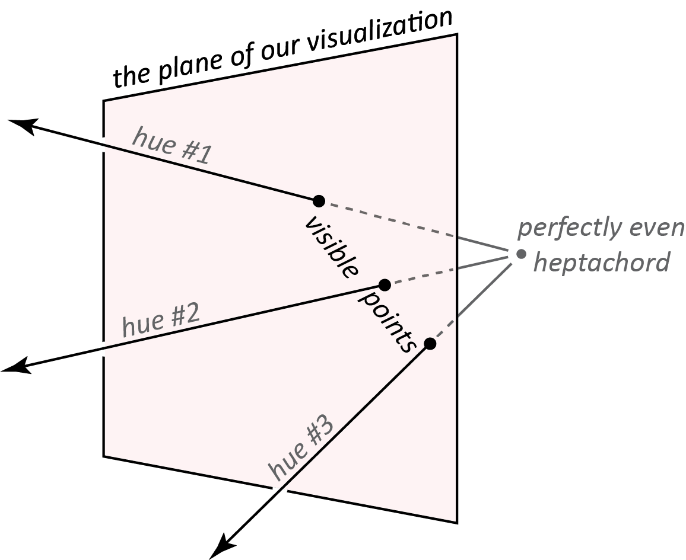

```{r, include = FALSE}
knitr::opts_chunk$set(
  collapse = TRUE,
  comment = "#>"
)
```

```{r setup}
library(musicMCT)
```

>"To deal with hyper-planes in a 14-dimensional space, visualize a 3-D space and say 'fourteen'
to yourself very loudly. Everyone does it."
>
>--- [Geoffrey Hinton](https://www.cs.toronto.edu/~hinton/coursera_slides.html)
(Lecture 2, Slide 16 from his 2012 Coursera course *Neural Networks for Machine Learning*)

---

# Introduction

The hardest part of using Modal Color Theory is the high number of dimensions that it needs
to describe most scales. A scale with $n$ notes lives in a space of $n-1$ dimensions. (The
$-1$ comes from the fact that we consider scales to be transpositionally equivalent, so you
can assume that $\hat{1}$ of every scale is 0.) This means that pentachords, the smallest
collection that we're likely to really consider to be scale-like, need to be understood in
four dimensions--already not easy to visualize--and it only gets worse from there.

Fortunately, R can help us visualize the scale-space geometries two or three dimensions at
a time. This won't be a picture of the whole space all at once, but it's a lot better
than nothing. This vignette models using musicMCT to depict a few specific cross-sections 
of the hyperplane arrangements.

We're going to explore the specific but important case of heptachords, using a strategy 
inspired by the old practice of building scales by combining two tetrachords.
This practice derives from ancient Greek music theory and forms an important part
of the theory of Arabic maqamat. I should stress, though, that this vignette is 
*inspired by* those theories, not an attempt to explain or reformulate them. I'm
not an expert in either subject, and a maqam is more than just an ordered collection of
fixed pitches. Still, I do suspect that tetrachordal thinking is useful at least in part 
for the way that it simplifies the range of possibilities that a musician must consider 
when using a scale. That simplification is a point of commonality between the visualization 
we're about to do and the actual musical practices of Ancient Greek and Arabic classical 
musics (to the extent I understand them). I'd like to think that this commonality could 
be enough to allow MCT's mathematical model to enrich our understanding of these theories, 
but for this vignette our focus is only the technical problem of simplifying high-dimensional spaces.


<br>

# Seven Notes, Tetrachords, and Two Dimensions

## Defining the Spaces

Our initial approach will be to restrict attention to seven-note scales that can be
built from two tetrachords according to the following plan:

* The higher tetrachord is an exact transposition of the lower tetrachord by 7 semitones.
* The lower tetrachord has a fixed first pitch of 0 and a fixed final pitch of 5.
* The higher tetrachord's last pitch is thus exactly an octave above the first pitch of the lower. (This is a consequence of the previous two points.) Unlike *Musica enchiriadis*, we model scales with octave equivalence, meaning that our combination of two tetrachords produces a scale with 7 distinct pitches per octave.
* The middle two pitches of the lower tetrachord are freely variable, as long as they stay in the right order. (That is, they must be above 0, less than 5, and the second pitch must be lower than the third pitch.)

Transpositional combination of this sort is easy to perform in musicMCT with the function
`tc()`. Let's see how the normal 12-equal major scale can be derived as the transpositional
combination of an (0, 2, 4, 5) tetrachord at a perfect fifth:

```{r}
tc(c(0, 2, 4, 5), c(0, 7))
```

This structure is useful because it fixes most of the pitches in the scale, allowing only
the values of the middle two notes in the lower tetrachord to vary freely. (The middle
pitches of the upper tetrachord must match the lower one, so they are completely determined
by our decisions about scale degrees 2 and 3.) This means that all scales with this structure
live in a two-dimensional subspace of the overall heptachord geometry: the two dimensions
of the subspace correspond directly to our choices for the values of scale degree 2 and 3.
Let's define a function that takes in a pair of choices for the variable scale degrees (i.e.
a "genus" in Ancient Greek theory) and returns an entire scale:

```{r}
scale_from_genus <- function(genus) {
 sd2 <- genus[1]
 sd3 <- genus[2]
 if (sd2 > sd3) {
   return(NA)
 }
 tc(c(0, sd2, sd3, 5), c(0, 7))
}
```

Since the space of such scales is only two dimensional, it will be easy to visualize on a
normal x-y plot. The space is a planar slice through the complete 6-D heptachord space.
For concision, I'll call it the "`tc()` plane" since we can build any scale in it with `tc()`.

To understand the `tc()` plane's relationship to the whole heptachord space, recall that 
every "hue" in MCT is a ray that emanates outward from the perfectly even scale
at the center of the space (in this case, seven-tone equal temperament). The perfectly
even heptachord cannot be constructed by `scale_from_genus()`, so it does not lie on 
the `tc()` plane. Therefore, each point in our visualization will be an
intersection between some hue and our `tc()` plane. You might think of our
visualization as a window pane that we're looking through: each spot on the pane 
actually corresponds to a line of sight in our field of view. Figure 1 sketches this
schematically, but remember that the actual `tc()` plane is embedded in a 6-D space rather than
the normal 3-D world:

```{r out.width = '75%', echo = FALSE}
#| fig.alt: >
#|   An abstract geometrical diagram, in which a flat plane in three-dimensional
#|   space is seen at a slight angle. Behind the plane, from the viewer's perspective,
#|   is a point labeled "perfectly even hexachord." Three arrows originate from that point
#|   and pass through the plane. The arrows are labeled "hue number 1," "hue number 2," and
#|   "hue number 3." The points of intersection between the plane and the arrows are
#|   highlighted and labeled as "visible points."

```

**Figure 1: Schematic representation of the tc() plane in heptachord space**

<br>


Figure 1 is not a precise picture of heptachord space, but as a step toward interpreting
our actual visualizations, we might imagine that the ray labeled "hue 1" represents the
hue of meantone major scales. Another way to say this is that "hue 1" represents all the
heptachords that have Carey and Clampitt's property of "well formedness" and can be represented
as the pattern of steps LLSLLLS where L and S represent large and small steps. As long as L > S
and the pattern of 5 large and 2 small steps adds up to a full octave, any choice of specific
values for L and S will result in a scale that lies along this hue. The point where hue #1 intersects
the `tc()` plane will be specifically the scale where L=2 and S=1, which is to say exactly the 
familiar major scale from 12-tone equal temperament. (We know that the intersection between the
hue and the `tc()` plane must be this specific scale, because our `tc()` construction guarantees that the
interval of disjunction between the two tetrachords is exactly 2 semitones, which forces our hand
with regard to all the other L and S step sizes.)

Similarly, we might imagine that "hue 3" represents well-formed heptachords with the step pattern
SLLLSLL, which is to say all tunings of the phrygian octave species. The visible point on both
hue 3 and the `tc()` plane is then 12tet phrygian: (0, 1, 3, 5, 7, 8, 10).

Hue 2 has been drawn to lie in between hues 1 and 3: all three hues lie on a single plane in heptachord
space which cuts across the `tc()` plane. The plane containing hues 1, 2, and 3 intersects the `tc()` plane
in a line, so the three "visible points" in Figure 1 all lie on a line in the `tc()` plane. The visible
point of hue 2 must be some intermediate scale between ionian and phrygian. If it were exactly half way
between those two diatonic modes, its values would simply an average of ionian and phrygian: (0, 1.5, 3.5,
5, 7, 8.5, 10.5). This would actually be another well-formed scale with the step pattern SLSLSLS. But, given
the way I've drawn the figure, it looks to me like hue 2 is slightly closer to hue 3 than hue 1, so we might
guess that it represents the scale (0, 1.4, 3.4, 5, 7, 8.4, 10.4). This has the step pattern SLMLSLM (where M
represents a **m**edium step size somewhere between the **s**mall and **l**arge steps). This is not
coincidentally a pattern that fits David Clampitt's definition of a "pairwise well-formed" scale. Such scales
are always two-dimensional subspaces that run from one well-formed hue to another.

If you aren't familiar with well-formed and pairwise well-formed scales, don't worry too
much about the preceding paragraph. The important point is that a scalar subspace which is inherently
two-dimensional (like the plane containing all of hues 1, 2, and 3) will show up in our visualization
as a single line (i.e. the line connecting the three visible points in Figure 1). More generally, any structure
that looks like it has dimension $k$ in the `tc()` plane will actually have dimension $k+1$ in the overall space.
Our visualization is a 2-D plane but it smuggles in a third dimension, which is the one that travels in and out along the
hues in Figure 1. (This dimension is what MCT calls "saturation"; it can be manipulated with `saturate()`.) You might
compare this to looking at a street map of a city, which is inherently 2-D but where you can easily imagine an invisible 
height dimension.

## Familiar Scales as Landmarks

Now that we know what the `tc()` plane is and have a sense of how it relates to the overall heptachord space, let's
start actually visualizing it. We'll begin by plotting a few specific scales to use as reference points. 
Among scales that have familiar names in Western music theory, there are several that have the desired tetrachordal structure:

```{r, fig.width=5, fig.height=5, fig.fullwidth=TRUE}
ionian <- scale_from_genus(c(2, 4)) #1
dorian <- scale_from_genus(c(2, 3)) #2
phrygian <- scale_from_genus(c(1, 3)) #3
double_harmonic <- scale_from_genus(c(1, 4)) #4
enharmonic <- scale_from_genus(c(.5, 1)) #5

demo_scales <- cbind(ionian, dorian, phrygian, double_harmonic, enharmonic)
```

To see these scales on the plane, we define the function `tetra_plot()` and feed our scales into it.

```{r, fig.width=5, fig.height=5, fig.fullwidth=TRUE}
#| fig.alt: >
#|   An x-y plot of poitns on the Cartesian plane. The x-axis is labeled
#|   "height of scale degree 2" and the y-axis is labeled "height of scale
#|   degree 3." Five specific points are plotted on the plane. For instance
#|   a point labeled "1" lies at the coordinates (2, 4); this point represents
#|   the ionian scale.
tetra_plot <- function(scales, title, ...) {
  oldpar <- par(bg='aliceblue')
  on.exit(par(oldpar))

  plot(scales[2, ], 
       scales[3, ], 
       xlab="Height of scale degree 2", xlim=c(-.05, 5.05),
       ylab="Height of scale degree 3", ylim=c(-.01, 5.01),
       ...)
  grid(col="gray35")
  mtext(side=3, title, font=2, line=1)
}
tetra_plot(demo_scales, 
           "Location of 5 Reference Scales in the tc() Plane",
           pch=sapply(1:5, toString)) 
```

**Figure 2**

<br>


The scales are marked by numbers in the order that we defined them: the ionian scale
is "1", dorian "2", and so on. It will be useful to keep these points in mind as
landmarks while we populate the space with more scales. (Note, by the way, that ionian is #1 and
phrygian is #3 just like they were in Figure 1. This is just a coincidence. In our plot, dorian is #2
and doesn't lie on a straight line between 1 and 3, so it doesn't correspond to "hue #2" from Figure 1.)

The `tc()` plane has an inversional symmetry that's just barely visible in this initial plot, but which
becomes more conspicuous as we add scales. Both scale 2 (dorian, {0, 2, 3, 5, 7, 9, 10}) and scale
4 (double harmonic, {0, 1, 4, 5, 7, 8, 11}) are symmetrical under $T_0 I$. All scales in the `tc()` plane
that lie on the northwest-southeast line from #2 to #4 have this same symmetry. Moreover, pairs of scales
that are reflections across that line are transformed into each other by $T_0 I$. That's the transformation
that takes C major (at point 1) to C phrygian (at point 3). Similarly, we could imagine reflecting the
scale built from the enharmonic genus at point 5 across the line of inversional symmetry, which should give
a new scale in the top right quadrant of the graph, with quarter-tone steps clustered toward the top of 
its tetrachords. Let's verify that this works and plot the new scale as point #6:

```{r, fig.width=5, fig.height=5, fig.fullwidth=TRUE}
# Invert the original enharmonic scale:
inverted_enharmonic <- tni(enharmonic, 0)

# Define a new enharmonic scale based on where we expect to plot it:
new_enharmonic <- scale_from_genus(c(4, 4.5))

# The two are the same:
rbind(inverted_enharmonic, new_enharmonic)

# Let's plot them:
demo_scales <- cbind(demo_scales, inverted_enharmonic)
#| fig.alt: >
#|   A Cartesian x-y plot that reproduces Figure 2 with an additional point (labeled "6")
#|   added at the coordinates (4, 4.5).
tetra_plot(demo_scales, 
           "Location of 6 Reference Scales in the tc() Plane",
           pch=sapply(1:6, toString)) 
```

**Figure 3**

<br>


That definitely starts to make the symmetry of the space more visually clear. Before we move on, let's
encapsulate the work we've done with a new function, `show_landmarks()`, which lets us add reminders of
these six scales to any new plots we create:

```{r}
show_landmarks <- function() {
  points(demo_scales[2, ], demo_scales[3, ], pch=19, cex=2.5, col="white")
  points(demo_scales[2, ], demo_scales[3, ], pch=sapply(1:6, toString), font=2)
}
```


## Visualize all the colors

Let's now take a look at the landscape of the whole plane, not just individual points on it. The simplest
question we might ask is "how many distinct scalar colors can be visualized on the `tc()` plane?" We can
answer that by randomly sampling many points on the plane, calculating their sign vectors, and counting
how many distinct sign vectors result. First we'll do that only as a numeric computation, sampling 4000
points in the plane:

```{r}
num_points <- 4000
parhypatai <- runif(num_points, 0, 5)
lichanoi <- runif(num_points, 0, 5)
inputs <- rbind(parhypatai, lichanoi) |> apply(MARGIN=2, FUN=sort)
random_scales <- apply(inputs, 2, scale_from_genus)
all_signvectors <- apply(random_scales, 2, signvector)
unique_signvectors <- all_signvectors |> unique(MARGIN=2) |> apply(MARGIN=2, FUN=toString)
unique_signvectors <- sort(unique_signvectors)
length(unique_signvectors)
```

This tells us that the scales we've sampled represent 26 different scalar colors. We can see them by 
plotting all the scales, coloring each point to reflect which scalar "color" it belongs to. (Of course,
the association between each visual color and the scalar structure it represents is arbitrary: there's
nothing essentially more blue or red about one scale structure than another.) Let's also include the
six "landmark" scales from Figure 3, plotted as numbers rather than colored points:

```{r echo=FALSE}
new_order <- c(1, 15, 17, 21, 3, 19, 25, 11, 9, 13, 5, 23, 7, 2, 16, 18, 22, 4, 20, 26, 12, 10, 6, 24, 8, 14)
unique_signvectors <- unique_signvectors[new_order]
```

```{r, fig.width=5, fig.height=5, fig.fullwidth=TRUE}
match_sv <- function(sv) {
  res <- which(unique_signvectors == toString(sv))
  if (length(res)==0) {
    return(0)
  }
  res
}

scalar_colors <- apply(all_signvectors, 2, match_sv)
display_colors <- palette.colors(26, palette="Polychrome 36")[scalar_colors]

#| fig.alt: >
#|   An x-y plot in which several polygons (mostly in the shape of triangles and
#|   trapezoids) are filled in with colored points.
tetra_plot(random_scales, 
           "26 Scalar Colors in the tc() Plane",
           col=display_colors,
           pch=20)
show_landmarks()
```

**Figure 4**

<br>


Each colored polygon in this figure represents a different scale structure. For instance, landmark #4
(the "double harmonic" scale) sits at the boundary between two right triangles (reddish purple to its 
lower left and yellow-green to its upper right). Scales inside those colored polygons have three degrees of freedom
to vary their pitches without fundamentally altering their structure: up/down and left/right as visualized and
also in/out along their line of saturation. (Recall Figure 1.) All of the scales that Figure 4 plots as colored points
have these 3 degrees of freedom: our random sample of scales on the plane didn't produce any 1- or 2-D scales because
it's very unlikely that a randomly generated scale will have more regularity than what is required by our definition
of scale_from_genus(). Nonetheless, we can see the 1- and 2-D scales in Figure 4 as the boundaries between
colored polygons. Landmark scale #4 (double harmonic), for instance, is 2-D because it lies directly on the line segment
that separates the reddish purple and yellow-green triangles:

```{r}
howfree(double_harmonic)
```

Scalar colors with only one degree of freedom show up on the `tc()` plane as points where multiple lines intersect. All three
diatonic modes that we can visualize (landmarks #1, #2, and #3) are at such intersections, and (like all well-formed scales)
that have only one degree of freedom:

```{r}
howfree(ionian)
howfree(dorian)
howfree(phrygian)
```

If we wanted to run some calculations on examples of the 1- or 2-D scales, we would need a way to generate them explicitly.
We could think through defining them with a specific function, along the lines of scale_from_genus(), but musicMCT also allows
us to project a given scale onto any "flat" (i.e. intersection of hyperplanes) in the arrangement. If we know the specific
hyperplanes that we want to project onto, we can use `project_onto()`; but if we have a specific scale that already lies on the
desired flat, we can use `match_flat()`. To see this latter function in action, let's project all 4000 sampled scales onto 
the same flat as the double harmonic scale: we should end up with 4000 points all lying on the same northwest-southeast diagonal
line as double harmonic itself. I'll plot the new projected scales as black points, in addition to the colorful points from Figure 4.

```{r, fig.width=5, fig.height=5, fig.fullwidth=TRUE}
projected_scales <- apply(random_scales, 2, match_flat, target_scale=double_harmonic)
colors_for_projected_scales <- rep("black", num_points)
scales_for_fig5 <- cbind(random_scales, projected_scales)
colors_for_fig5 <- c(display_colors, colors_for_projected_scales)

#| fig.alt: >
#|   A copy of Figure 4, the plot filled with colorful polygons. The
#|   only new detail is a black line that extends from the top left corner
#|   of the plot toward the bottom right corner.
tetra_plot(scales_for_fig5,
           "Double Harmonic's Flat as a Line of Black Points",
           col=colors_for_fig5,
           pch=20)
show_landmarks()
```

**Figure 5**

<br>


Now that we have specific examples of scales on that flat to work with, we can explore whatever properties we're interested
in. For instance, [Clampitt 2009](https://doi.org/10.1007/978-3-642-04579-0_46) tells us that the `double_harmonic` scale 
is "pairwise well-formed." (In fact, it's an example of the unusual class of *singular* pairwise-well formed scales.) Do 
all the scales that lie on its flat have that property, too?

```{r}
test_for_pwf <- apply(projected_scales, 2, isgwf)
table(test_for_pwf)
```

All 4000 of our `projected_scales` return `TRUE`: they're all pairwise well-formed! It's not hard to show that this is true
in general: like well-formedness, pairwise well-formedness is either always true or always false for the 2-D scales on a 
given flat.

## Optimizing evenness on the "double harmonic" flat


Properties that can only be true or false aren't terribly interesting to visualize, so let's also play around with a property
that can take continuous values. For instance, might wonder the scales' `evenness()` changes as we vary along the line. We'll calculate 
the evenness of each scale that lies on the flat and plot the points so that more even scales are represented by larger points.

```{r, fig.width=5, fig.height=5, fig.fullwidth=TRUE}
evenness_values <- apply(projected_scales, 2, evenness)
sizes_for_fig6 <- c(rep(1, num_points), max(evenness_values)-evenness_values)

#| fig.alt: >
#|   A copy of Figure 5 in which the thickness of the
#|   black line varies. The line starts very thin at the
#|   top left corner of the plot, then grows to be thick at the middle
#|   before tapering off at its end.
tetra_plot(scales_for_fig5,
           "Line Thickness Represents Scale Evenness",
           col=colors_for_fig5,
           pch=20,
           cex=sizes_for_fig6)
show_landmarks()
```

**Figure 6**

<br>


You can see that the largest points (and thus the most even scales) lie in the zone between landmarks 2 and 4. The scales
get very uneven as we move toward the top left corner of the plot. This makes sense, because the point (0, 5) at the
top left of the `tc()` plane represents a scale whose $\hat{2}$ is 0 (the same as $\hat{1}$) and whose $\hat{3}$ is
5 (the same as $\hat{4}$): such a scale is very uneven because its "stepwise motion" varies widely between not moving
at all and making large leaps.

Now, most of the detail in the `tc()` plane lies in the square bounded by landmarks 1, 2, 3, and 4. It's hard to tell exactly
how many colors lie in that region, and similarly hard to tell exactly where the thickest point on the diagonal black line is.
We can zoom in to get a better view of that part of the plane:


```{r, fig.width=5, fig.height=5, fig.fullwidth=TRUE}
zoomed_tetra_plot <- function(scales, title, ...) {
  oldpar <- par(bg='aliceblue')
  on.exit(par(oldpar))
  plot(scales[2,], 
       scales[3, ], 
       xlab="Height of scale degree 2", xlim=c(0.95, 2.05),
       ylab="Height of scale degree 3", ylim=c(2.99, 4.01),
       ...)
  grid(col="gray35")
  mtext(side=3, title, font=2, line=1)
}

zoomed_parhypatai <- runif(num_points, 1, 2)
zoomed_lichanoi <- runif(num_points, 3, 4)
zoomed_inputs <- rbind(zoomed_parhypatai, zoomed_lichanoi)
zoomed_sets <- apply(zoomed_inputs, 2, scale_from_genus)
zoomed_signvectors <- apply(zoomed_sets, 2, signvector)
zoomed_scalar_colors <- apply(zoomed_signvectors, 2, match_sv)
zoomed_display_colors <- palette.colors(26, palette="Polychrome 36")[zoomed_scalar_colors]

points_for_fig7 <- cbind(zoomed_sets, projected_scales)
colors_for_fig7 <- c(zoomed_display_colors, colors_for_projected_scales)
sizes_for_fig7 <-c(rep(1, num_points), 3^(evenness(double_harmonic)-evenness_values))

#| fig.alt: >
#|   An enlarged copy of Figure 6, displaying the central square
#|   of Figure 6 in more detail.
zoomed_tetra_plot(points_for_fig7, 
                  "Scalar Colors in the tc() Plane's Most Interesting Zone",
                  col=colors_for_fig7,
                  pch=20,
                  cex=sizes_for_fig7)
show_landmarks()
```

**Figure 7**

<br>


I've exaggerated the variation in the black line's thickness to help us see where the most even scale
lies in Figure 7. The line seems to be thickest at about an x value of 1.6 and a y value of 3.4. Of course,
we don't have to eyeball this, since we can just check the evenness values directly:

```{r}
which_most_even <- which.min(evenness_values)
projected_scales[, which_most_even]
```

We might have guessed that the maximum evenness was at the round numbers of $1 \frac{2}{3}$ and $3 \frac{1}{3}$, but the
real answer is is somewhat more surprising:

```{r}
naive_guess <- scale_from_genus(c(1+(2/3), 3+(1/3)))
actual_optimum <- scale_from_genus(c(23/14, 47/14))

evenness(naive_guess)
evenness(actual_optimum)
```

Since `evenness()` returns lower values for more even scales, the `actual_optimum` scale with scale degree 2 at
$\frac{23}{14}$ semitones (about 1.6428) is in fact the most even scale on the black line in Figure 7. (The numbers
$\frac{23}{14}$ and $\frac{47}{14}$ may feel a bit less like they come out of nowhere when we notice that their
difference is $\frac{12}{7}$, meaning that the scale has a step from $\hat{2}$ to $\hat{3}$ which exactly matches
the equiheptatonic scale's step size.) Let's plot this scale as landmark 7:

```{r, fig.width=5, fig.height=5, fig.fullwidth=TRUE}
#| fig.alt: >
#|   A copy of Figure 7 in which a point labeled "7" is added
#|   at approximately the coordinates (1.65, 3.3).
zoomed_tetra_plot(points_for_fig7, 
                  "Most Even Scale at the Point Labeled #7",
                  col=colors_for_fig7,
                  pch=20,
                  cex=sizes_for_fig7)
show_landmarks()
points(23/14, 47/14, pch=19, cex=2.5, col="white")
points(23/14, 47/14, pch="7", font=2)
```

**Figure 8**

<br>


I was surprised by this when I wrote my first draft of this vignette, especially since the `naive_guess` scale
is not only a rounder number but also a more regular scale. It's at the point where 3 lines intersect just down 
and right of landmark 7: it's thus one-dimensional and, as it turns out, well-formed:

```{r}
howfree(naive_guess)
iswellformed(naive_guess)
```

I was surprised because I'd fallen into a simple trap: assuming that all apparently desirable qualities ought to 
coincide in one scale. This was an easy assumption to make because so much of Western music theory is devoted
to the notion that basic musical structures (like consonant triads and the diatonic scale) are overdetermined, points
where many neat features overlap. There's certainly truth to this, but our example of the `naive_guess` and 
`actual_optimum` scales is a reminder that often the situation is more like the tension between Pythagorean
and Ptolemaic "syntonic" tunings of the diatonic scale: two desirable properties can be optimized by scales that are quite
similar but ultimately distinct from one another. Hopefully this vignette shows how pairing direct computation with
visualization strategies can help us explore and understand such relationships.

<br>


# Smoother Images

Our approach in the previous section involved randomly sampling scales as its first step. This is 
especially convenient for quick prototyping and situations where you might want to run many computations on concrete
data points. But an obvious downside of the method, seen in Figures 4-7, is that random sampling produces a blotchy
image with gaps between the sampled points. If your goal is primarily to create a good image, R has better tools, 
particularly the function `image()`. This function requires a bit more care in the way you enter data as the price of 
entry for much better pictures.

## Familiar Ground

To see how it works, let's first use `image()` to reconstruct Figure 4:

```{r, fig.width=5, fig.height=5, fig.fullwidth=TRUE}
# Define a grid that covers the tc() plane evenly.
# x and y both range from 0 to 5 but with slight offsets so that we only see 3-D scales:
grid_subdivisions <- 100
x <- seq(0.001, 4.999, length.out=grid_subdivisions) 
y <- seq(0, 4.98, length.out=grid_subdivisions)

# Calculate the scale structures. (Cf. the definition of `scalar_colors` for Figure 4.)
color_from_point <- function(x, y) scale_from_genus(c(x, y)) |> signvector() |> match_sv()
scalar_colors <- outer(x, y, Vectorize(color_from_point))

# Create visuals
color_palette <- c("aliceblue", palette.colors(26, palette="Polychrome 36"))
oldpar <- par(bg="aliceblue")

#| fig.alt: >
#|   A variant of Figure 4's x-y plot with sharper edges.
image(x, y, z=scalar_colors, col=color_palette,
      xlab="Height of Scale Degree 2", ylab="Height of Scale Degree 3")
mtext(side=3, "26 Scalar Colors in the tc() Plane", font=2, line=1)
show_landmarks()
```

```{r, echo=FALSE}
par(oldpar)
```

**Figure 9**

<br>


Each region in this figure is now a continuous patch of color. The boundaries between colors ought to be straight
lines, though in Figure 9 the diagonal lines are pixelated. That's because `image()` creates the plot by dividing the
plane into a grid of squares to be colored. We could get a smoother-looking plot by dividing the image more finely: you
could try increasing `grid_subdivisions` in the above code block to a number greater than 100, though the larger
it gets, the more time is required to create the image.

## Other Properties

The `image()` function is especially useful for visualizing features that vary continuously. One such value is scalar
`evenness()`, as we explored in Figures 6-8. Let's use `image()` to plot the evenness of all points on the `tc()` plane. 
I'll also add a white "x" to show the location of landmark scale #7 from Figure 8.

```{r, fig.width=7, fig.height=5, fig.fullwidth=TRUE}
# Position plot and legend
oldpar <- par(no.readonly=TRUE)
layout(matrix(c(1, 2), ncol=2), widths=c(5, 2))

# Plot the evenness values
measure_evenness <- function(x, y) scale_from_genus(c(x, y)) |> evenness()
evenness_values <- outer(x, y, Vectorize(measure_evenness))
fig10_palette <- hcl.colors(100, palette="Green-Brown")

par(bg="aliceblue")
image(x, y, z=evenness_values, col=fig10_palette,
      xlab="Height of Scale Degree 2", ylab="Height of Scale Degree 3")
points(23/14, 47/14, pch=4, col="white", cex=1.5)
mtext(side=3, "Evenness of Scales in the tc() Plane", font=2, line=1)

# Make the legend
color_legend <- as.raster(matrix(rev(fig10_palette), ncol=1))
ymin <- min(evenness_values[!is.na(evenness_values)])
ymax <- max(evenness_values[!is.na(evenness_values)])
plot(c(0, 1), c(ymin, ymax), type="n", axes=FALSE, xlab="", ylab="Evenness")

#| fig.alt: >
#|   An x-y plot in which an oval-shaped green region is centered on a 
#|   white x shape. The color of the oval fades as distance from the x
#|   increases.
rasterImage(color_legend, 0, ymin, 1, ymax)
axis(2, at = round(seq(ymin, ymax, length.out=5), 2))
```

```{r, echo=FALSE}
par(oldpar)
```

**Figure 10**

<br>


The most even scales (dark green) are centered around the "x" that represents landmark #7 (the `actual_optimum` 
from before). This tells us that the `actual_optimum` is not only the most even scale on the flat
of `double_harmonic` but also the most even scale on the entire `tc()` plane. Otherwise, Figure 10 doesn't tell us
much that seems interesting: evenness decreases as you move away from the `actual_optimum` in any direction. (It 
decreases fastest if you move along the line of inversional symmetry and slowest if you move perpendicular to that
line.)

A much more interesting picture emerges if we plot the so-called "brightness ratio" value for the scales on the `tc()`
plane (values that can be calculated with musicMCT's `ratio()` function).

```{r, fig.width=7, fig.height=5, fig.fullwidth=TRUE}
oldpar <- par(no.readonly=TRUE)
layout(matrix(c(1, 2), ncol=2), widths=c(5, 2))

# Plot the brightness ratio values
measure_ratio <- function(x, y) scale_from_genus(c(x, y)) |> ratio()
ratio_values <- outer(x, y, Vectorize(measure_ratio))
fig11_palette <- hcl.colors(100, palette="Green-Brown")

par(bg="aliceblue")
image(x, y, z=ratio_values, col=fig11_palette,
      xlab="Height of Scale Degree 2", ylab="Height of Scale Degree 3")
mtext(side=3, '"Brightness Ratio" Values in the tc() Plane', font=2, line=1)

# Make the legend
color_legend <- as.raster(matrix(rev(fig11_palette), ncol=1))
ymin <- min(ratio_values[!is.na(ratio_values)])
ymax <- max(ratio_values[!is.na(ratio_values)])
plot(c(0, 1), c(ymin, ymax), type="n", axes=FALSE, xlab="", ylab="Brightness Ratio")

#| fig.alt: >
#|   An x-y plot visualizing the same range of values as Figure 10.
#|   The shape on the plot appears to be a complicated arrangement of
#|   triangles and lines. The plot's shape has bilateral symmetry 
#|   but no other obvious simple pattern.
rasterImage(color_legend, 0, ymin, 1, ymax)
axis(2, at = round(seq(ymin, ymax, length.out=5), 2))
```

```{r, echo=FALSE}
par(oldpar)
```

**Figure 11**

<br>


This is our clearest picture yet of the space's inversional symmetry. We can see a few spots in the
`tc()` plane where the color become a deep brown, representing high `ratio()` values. As I argue in "Modal Color Theory,"
low "brightness ratio" values seem to be a desirable property, particularly when the value drops below 1 so that a scale's
`delta()` value is smaller than `eps()`. There are indeed some parts of the plane where `ratio()` dips below
1. While the legend shows that this corresponds to dark greek colors, the color scheme doesn't make the 
distinction between `> 1` and `< 1` really easy to spot. We could play around with other color schemes, but we could instead 
take advantage of another function that works nicely in tandem with `image()`: `contour()` can plot contour lines that show
us where specific values in the plot occur:


```{r, fig.width=7, fig.height=5, fig.fullwidth=TRUE}
oldpar <- par(no.readonly=TRUE)
layout(matrix(c(1, 2), ncol=2), widths=c(5, 2))

# Plot the brightness ratio values
measure_ratio <- function(x, y) scale_from_genus(c(x, y)) |> ratio()
ratio_values <- outer(x, y, Vectorize(measure_ratio))
fig11_palette <- hcl.colors(100, palette="Green-Brown")

par(bg="aliceblue")
#| fig.alt: >
#|   A version of Figure 11's plot of a complicated shape. The 
#|   only new detail is a set of contour lines that show where
#|   constant values of the plotted parameter (the "brightness ratio")
#|   are found on the grpah.
image(x, y, z=ratio_values, col=fig11_palette,
      xlab="Height of Scale Degree 2", ylab="Height of Scale Degree 3")
mtext(side=3, 'Contour Plot of "Brightness Ratio" in the tc() Plane', font=2, line=1)

# Add the contour plot
contour(x, y, z=ratio_values, add=TRUE)

# Make the legend
color_legend <- as.raster(matrix(rev(fig11_palette), ncol=1))
ymin <- min(ratio_values[!is.na(ratio_values)])
ymax <- max(ratio_values[!is.na(ratio_values)])
plot(c(0, 1), c(ymin, ymax), type="n", axes=FALSE, xlab="", ylab="Brightness Ratio")
rasterImage(color_legend, 0, ymin, 1, ymax)
axis(2, at = round(seq(ymin, ymax, length.out=5), 2))
```

```{r, echo=FALSE}
par(oldpar)
```

**Figure 12**

<br>


From this, we certainly have a much clearer picture of which scales have a `ratio()` value below 1. But, as before, there's a lot
of detail at the center of the plot which is hard to make out in Figure 12, so let's zoom in to the central square like we did in
Figure 7.


```{r, fig.width=7, fig.height=5, fig.fullwidth=TRUE}
oldpar <- par(no.readonly=TRUE)
layout(matrix(c(1, 2), ncol=2), widths=c(5, 2))

grid_subdivisions <- 100
u <- seq(1.001, 1.999, length.out=grid_subdivisions)
v <- seq(3, 3.98, length.out=grid_subdivisions)

ratio_values2 <- outer(u, v, Vectorize(measure_ratio))
fig11_palette <- hcl.colors(100, palette="Green-Brown")

par(bg="aliceblue")
image(u, v, z=ratio_values2, col=fig11_palette,
      xlab="Height of Scale Degree 2", ylab="Height of Scale Degree 3")
contour(u, v, z=ratio_values2, add=TRUE)
mtext(side=3, "\"Brightness Ratio\" at Center of tc() Plane", font=2, line=1)

# Make the legend
color_legend <- as.raster(matrix(rev(fig11_palette), ncol=1))
ymin <- min(ratio_values2[!is.na(ratio_values)])
ymax <- max(ratio_values2[!is.na(ratio_values)])
plot(c(0, 1), c(ymin, ymax), type="n", axes=FALSE, xlab="", ylab="Brightness Ratio")

#| fig.alt: >
#|   An enlarged version of the center of the plot in Figure 12. Shapes that looked 
#|   like triangles in Figure 12 are revealed to have slightly more complex shapes
#|   (such as check-mark shapes, an oblong diamond, and a star-like concave shape).
rasterImage(color_legend, 0, ymin, 1, ymax)
axis(2, at = round(seq(ymin, ymax, length.out=5), 2))
```

```{r, echo=FALSE}
par(oldpar)
```

**Figure 13**

<br>


We can see a lot more detail here! Some of the shapes in this picture look pretty interesting, and so far I don't know the whole story
behind them. One thing that is good to note is that our color scale has shifted slightly: the highest `ratio()` shown in Figure 13 is 
about 4.73, slightly more than Figure 13's maximum value of 3.89. That's because we've zoomed further in toward the highly concentrated
brown patches, like the one centered at (1.5, 3.5). The brown patches' centers are all points that represent scales with one degree
of freedom. For instance, the point (1.5, 3.5) is an intersection of 4 distinct lines as you can check by going back to Figure 9.
These 1-D scales actually tend to have very *low* `ratio()` values. For instance:

```{r}
ratio(scale_from_genus(c(1.5, 3.5)))
```

gives the result of 0 because that scale is yet another one in the `tc()` plane with the property of well-formedness. Scales that get
*close* to well-formed scales (or other scales of high regularity) tend to experience steep increases in their `ratio()` value. This
means that visualizations of `ratio()` like Figure 13 can often be used to spot high-regularity scales by the patches of high "brightness
ratio" that tend to surround them. The very regular scales like `scale_from_genus(c(1.5, 3.5))` don't themselves show up on Figure 13
because, like Figure 4, Figure 13 only plots scales with three degrees of freedom. Even if the more regular scales were plotted directly
on the figure, they would be largely drowned out by the more numerous 3-D scales since they represent only individual points.

## A Caveat

Visualizing a space can have powerful effects, making the space feel more real and more intuitively graspable. This is certainly a good
reason to do it, and the intuitions that you can build about MCT spaces from exercises like this vignette are legitimately useful. But 
while doing so we also need to remind ourselves of the limitations of the method chosen. In the case of the `tc()` plane, a significant 
danger lies in how drastically it oversimplifies the heptachord arrangement: the `tc()` plane itself is a tiny sliver of the space. We shouldn't
let its simplicity mislead us. For instance, looking back at Figure 9, we see that the well-formed major scale (landmark #1) is surrounded
by 6 distinct colorful regions (i.e. six 3-D structures) and 6 line segments (i.e. six 2-D structures). Those six neighboring colors are
a minuscule fraction of all the colors that neighbor the major scale's hue. It has 22,506 neighbors (plus one for the "white" equiheptatonic).
Most of these are 4-, 5-, or 6-D and could never have shown up on the `tc()` plane. But 332 of its neighbors are 2-D and 2852 of them are 3-D.
Imagine 332 line segments that all touch landmark 1, not just 6 of them! That's a good reminder of the real complexity of the space.


## Conclusion

To wrap up briefly, the steps we've taken to build the above figures demonstrate a few options for visualizing structures in the Modal 
Color Theory spaces. In my own exploration of these spaces, I've found it very helpful to be able to cook up images that give me some
visual sense of what's going on in a region of interest. We've seen how one useful approach can be to define some subspace--some slice
through the many dimensions of all possible scales--like the `tc()` plane, to reason about its relationship to the overall space, and 
to learn to recognize various structures that occur within it (like the point representing the meantone major scale or the line representing
the double harmonic scale's flat). Sometimes, just learning to read a figure and checking our visual intuitions against numerical values
can lead to interesting & novel observations, like in our discussion of the `naive_guess` and `actual_optimum` scales around Figures 7 and 8.

Finally, I should mention that throughout this vignette all of the images we've seen (except for Figure 1, which I made in an 
external graphics program) were produced only by functions that come with default installations of R. There are many packages that supplement
R's basic graphics capacities, such as the package ggplot2, which might come in handy for projects that have more complicated plotting needs.

---


**Last updated:** 28 November 2025
